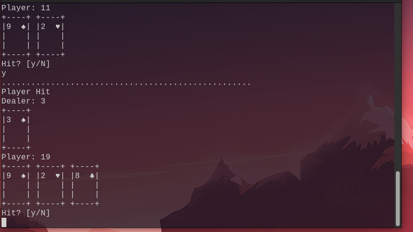
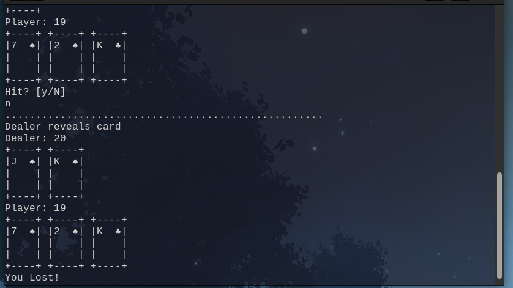
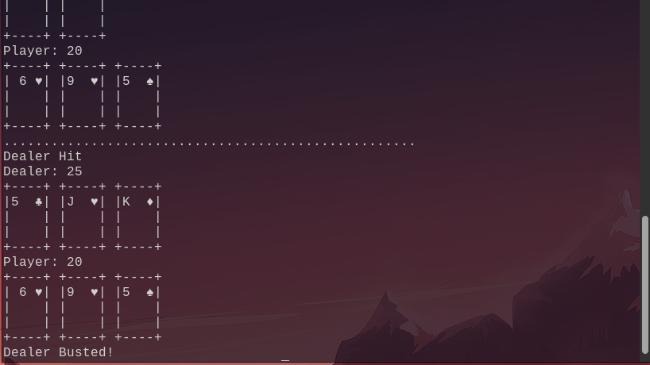

# Blackjack in the command-line
Simple blackjack program (incomplete) to be played in the command line using Python and the random library.


To play the game simply clone the repository and, while in the file, run the following command in the console:
```
python3 blackjack.py
```


Here are some visual examples of the program.







