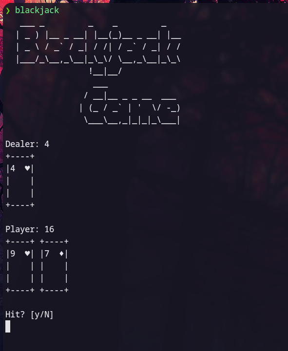

# Blackjack in the command-line

**Simple Python program to play Blackjack in the command line!** 

Install the package running
```
make
```

Alternatively you can just run
```
pip3 install .
```

--- 

Once installed simply run `blackjack` from your terminal to start playing!

`make clean` will remove those dirty build packages once the package is installed.

`make uninstall` can also be quickly used if you don't like the package :(.

You should have `.local/bin` on your $PATH (virtualenv also requires this for example). To do this add the following to your `.bashrc`, `.zshrc`, etc.

```
export PATH=$HOME/.local/bin:$PATH
```

Pictures



